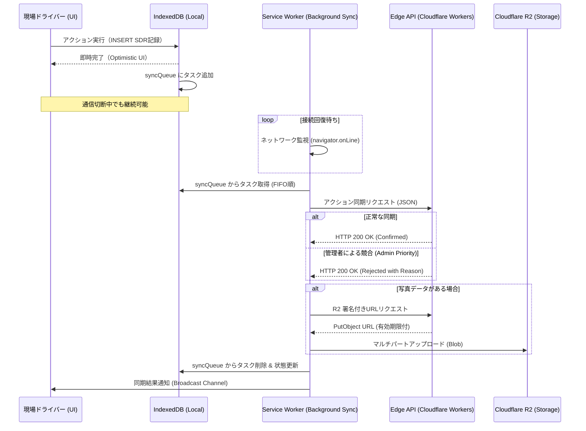

# **Vite + React + TypeScript 環境におけるオフラインファースト・エンタープライズPWA実装ガイドライン**

本報告書は、Vite、React、およびTypeScriptを基盤とした「TBNY DXOS」プロジェクトにおいて、物流現場のドライバーが直面する過酷な通信環境と物理的制約を克服するための、次世代PWA（Progressive Web App）実装指針を提示する。

### **【重要】適用範囲（Scope）の分離**
本ガイドラインで定義される物理的制約（44pxタップターゲット、12px間隔、18pxフォント等）は、**「スマホ/タブレット操作を前提としたDriverアプリ（現場用UI）」にのみ強制適用**される。

*   **Driverアプリ（スマホ前提/現場用）**: 44px以上のタップ領域、12px以上のボタン間隔、18px以上の重要フォント、グローブ対応、オフラインファースト、INSERT型SDRログが**絶対条件**。
*   **管理者・事務向け（PC前提/オフィス用）**: マウス操作を前提とした高密度なデスクトップUX（14px前後の標準フォント、高密度な表表示、標準的なクリック領域）を**積極的に推奨**。オフィスでの生産性を重視し、不要な巨大UIは避けること。

ただし、データの整合性に関する基準（IndexedDBによる不揮発性、SDR形式の意思決定記録）は、デバイスを問わずプロジェクト全体の共通統治基準とする。

既存のNext.js中心の設計思想から脱却し、ブラウザ標準APIとViteエコシステムを最大限に活用した、堅牢かつ高ユーザビリティなアプリケーション構築手法を詳述する。


## **推論戦略（Chain of Thought）の開示**

本ガイドラインの策定にあたり、以下の3つのステップによる推論プロセスを実行した。

### **Next.js固有機能のUX的価値の代替技術特定**

Next.jsが提供する強力な抽象化機能（next/imageによる画像最適化、ISRによる段階的静的生成、API Routesによるサーバー機能）は、サーバーサイド実行環境を前提としている。しかし、ドライバーが利用するPWAにおいては、オフライン時の動作保証が最優先事項であり、サーバー依存の機能はUXのボトルネックとなり得る 。

* **画像最適化:** next/imageは実行時のオンデマンド変換を主とするが、オフラインを前提とするRePaper Routeでは、ビルド時に全てのバリエーションを生成するvite-plugin-image-optimizerとsharpの組み合わせが適している 。
* **ISR:** サーバーでの再生成を待たず、Service Workerのstale-while-revalidate戦略を用いることで、クライアントサイドで「即時表示とバックグラウンド更新」を実現する 。
* **API Routes:** Node.jsランタイムを必要とするAPI Routesを捨て、Cloudflare WorkersとHonoを採用することで、エッジでの低レイテンシ処理と、R2ストレージへのネイティブなバイナリ書き込みを実現する 。

### **型安全な競合通知UIの実装**

**問：** 「Admin Priority（管理者優先）ルールにより現場の入力データが棄却された際、ドライバーの不信感と手戻りを防ぐための『型安全な競合通知UI』はどう実装すべきか？」 **答：** 単なる「エラー表示」ではなく、入力証跡を「棄却された事実も含めて」INSERT型で保持するSDR（State/Decision/Reason）記録パターンを採用する 。 UIレベルでは、TypeScriptのDiscriminated Unions（判別共用体）を用いて、現在の状態が「サーバー確定値（Confirmed）」か「ローカル未同期値（Pending）」か「同期競合・棄却済（Rejected）」かを型安全に管理する 。ドライバーに対しては、「管理者がこの理由（Reason）で変更したため、あなたの入力は履歴として保存されました」というコンテキスト付きの通知を、作業を妨げないバナー形式で提示する 。

### **同期優先度制御ロジックの策定**

vite-plugin-pwaのinjectManifest戦略を用い、WorkboxのQueueクラスをカスタマイズすることで、同期の優先度制御を実現する 。

* **高優先度（Weight/SDR）:** 軽量なJSONデータとして、接続回復時に即座にFIFOキューから送信する 。
* **低優先度（Photos）:** 画像データは一旦IndexedDBのBlobとして保持し、メタデータの同期が完了した後、帯域幅に余裕があることを確認してからCloudflare R2へのマルチパートアップロードを実行する 。
---

## **1. 【技術置換マトリクス】: Next.js 機能 vs Vite 代替案**

エンタープライズPWAにおいて、Next.jsからViteへ移行する最大の理由は、デプロイメントの結合分離と、Node.jsランタイムに依存しない純粋な静的アセットとしての配布能力にある 。以下の表は、Next.jsの主要機能に対するVite環境での代替案と、判断理由（SDR）をまとめたものである。

| Next.js 機能 | Vite/Web API 代替案 | 判断の理由 / SDR (State-Decision-Reason) |
| :---- | :---- | :---- |
| next/image | vite-plugin-image-optimizer | **S:** 実行時変換はオフライン時に機能しない。 **D:** ビルド時にWebP/AVIFへの変換と圧縮を完了させる。 **R:** 通信断絶下でも最適化済アセットをキャッシュから即時提供するため 。 |
| ISR (Incremental Static Regeneration) | Workbox StaleWhileRevalidate | **S:** サーバーサイドの再生成はクライアントのオフライン状態を考慮できない。 **D:** Service Workerによるキャッシュ優先提供。 **R:** UX上の「待ち時間ゼロ」を実現しつつ、バックグラウンドで最新データを同期するため 。 |
| API Routes | Cloudflare Workers (Hono) | **S:** Node.jsフルサーバーの維持はコストとレイテンシの無駄。 **D:** 軽量なエッジ関数への移行。 **R:** Cloudflare R2/D1とのネイティブ連携により、グローバルなデータ一貫性と高速なバイナリ処理を両立するため 。 |
| next/font | unplugin-fonts | **S:** 外部フォントのロード失敗はPWAの「ネイティブ感」を損なう。 **D:** フォントの完全ローカルホスティング。 **R:** オフライン時でも一貫したタイポグラフィを維持し、LCP（Largest Contentful Paint）を改善するため 。 |
| Server Actions | fetch + BackgroundSync | **S:** サーバーアクションはオンライン前提の設計。 **D:** IndexedDBへの書き込みを起点とした非同期同期モデル。 **R:** 物理的な通信切断を「エラー」ではなく「遅延」として構造的に扱うため 。 |
| Middleware | Edge Middleware | **S:** 認証チェックをクライアントJSに任せるとオフライン起動が複雑化する。 **D:** エッジ側での事前処理。 **R:** クライアントへ到達する前にリクエストを最適化し、セキュリティとパフォーマンスを担保するため 。 |

Next.jsはSEOやEコマースといった「不特定多数への情報配信」に最適化されているが、物流管理のような「特定の業務を遂行するダッシュボード」においては、Viteの高速なHMR（Hot Module Replacement）と、クライアントサイドでの完結性が開発効率とランタイムの信頼性を向上させる 。

---

## **2. 【オフライン同期フロー】: FIFO 同期および競合解決シーケンス**

RePaper Routeにおけるデータの流れは、常に「IndexedDBへの即時永続化」を起点とする 。ネットワークは常に不安定であるという前提（Offline-First）に立ち、データの整合性と証跡の保存を両立させる 。

### **2.1 FIFO 同期アーキテクチャの設計思想**

現場でのアクション（重量入力、運行順序入れ替え）は、IndexedDB内のsyncQueueストアにFIFO（First-In-First-Out）形式で格納される 。このキューは、Service Workerが接続回復を検知した際に順次処理される 。



### **2.2 競合解決：Admin Priority と INSERT 型証跡の融合**

本システムの特筆すべき点は、管理者による変更を優先しつつも、ドライバーの入力事実を物理的に消去しない点にある 。

* **データモデル:** すべての記録をversionまたはtimestamp付きのINSERT型（Append-only）で保持する 。
* **競合検知:** サーバー側（D1データベース）で最新のversionを確認し、不整合がある場合は「Admin Priority」を適用する 。
* **証跡保持:** ドライバーが「100kg」と入力し、管理者が「110kg」に修正した場合、DBには両方のレコードが残る。UI上は最新の確定値をメインで表示しつつ、履歴画面でドライバーの入力を「棄却（Rejected）」として表示する 。
* **信頼性の醸成:** ドライバーに対しては、単に「エラー」と表示するのではなく、「管理者がルート変更を行ったため、この重量入力は履歴として保存されました」という詳細な理由（Reason）を型安全に提示する 。
---

## **3. 【具体的実装ガイド】: Vite/TS 環境における堅牢な設計**

### **3.1 vite.config.ts：injectManifest による高度な制御**

デフォルトのgenerateSWではなくinjectManifestを使用することで、同期の優先度制御や複雑なプッシュ通知ロジックを自前で記述できる。これは、大容量画像とテキストデータを分離して同期するために不可欠な設定である 。

```typescript
// vite.config.ts
import { defineConfig } from 'vite';
import react from '@vitejs/plugin-react';
import { VitePWA } from 'vite-plugin-pwa';
import imageOptimizer from '@bro-academy/vite-plugin-image-optimizer';

export default defineConfig({
  plugins: [
    react(),
    imageOptimizer(),
    VitePWA({
      strategy: 'injectManifest',
      srcDir: 'src',
      filename: 'sw.ts',
      manifest: {
        name: 'RePaper Route',
        short_name: 'RePaper',
        theme_color: '#000000',
        icons: [ /* ... */ ]
      },
      workbox: {
        // オフライン時に必要な静的アセットを定義
        globPatterns: ['**/*.{js,css,html,webp,woff2}'],
        maximumFileSizeToCacheInBytes: 5 * 1024 * 1024
      },
      devOptions: {
        enabled: true, // 開発環境でもSWをデバッグ可能にする
        type: 'module'
      }
    })
  ]
});
```

### **3.2 Zod による SDR スキーマ定義と型安全な状態管理**

SDR（State/Decision/Reason）記録は、現場の意思決定プロセスを可視化するための中心的なデータ構造である。これを Zod で型定義し、TypeScript の推論を最大限に活用する 。

```typescript
import { z } from 'zod';

// 判別共用体による同期状態の定義
const SyncStatusSchema = z.discriminatedUnion('type', [
  z.object({ type: z.literal('pending'), queuedAt: z.number() }),
  z.object({ type: z.literal('synced'), confirmedAt: z.number(), serverId: z.string() }),
  z.object({ type: z.literal('rejected'), reason: z.string(), adminId: z.string() })
]);

export const SDRSchema = z.object({
  id: z.string().uuid(),
  entityId: z.string(), // 運行順序や特定の配送案件ID
  state: z.enum(['LOCKED', 'UNLOCKED', 'SYNCING']),
  decision: z.string().min(1, "意思決定の内容を入力してください"),
  reason: z.string().min(1, "判断の理由（SDR）は必須です"),
  weight: z.number().multipleOf(10, "10kg単位で入力してください").min(0).max(30000),
  photoKey: z.string().optional(), // Cloudflare R2上のキー
  timestamp: z.number(),
  sync: SyncStatusSchema
});

export type SDRRecord = z.infer<typeof SDRSchema>;

// IndexedDBへのINSERT操作をカプセル化する
export async function addSDRRecord(db: IDBDatabase, record: SDRRecord) {
  const tx = db.transaction('sdr_logs', 'readwrite');
  const store = tx.objectStore('sdr_logs');
  // put ではなく add を使用することで、INSERT-only を物理的に強制
  await store.add(record); 
}
```

### **3.3 重量入力コンポーネント：44px タップターゲットの確保**

厚手のグローブ着用時や、車両の振動を伴う環境では、標準的な数値キーパッドよりも「物理的に押しやすい」増減ボタンが推奨される 。MIT Touch Labの研究によると、人間の指のパッド面積は約9mm（48px相当）であり、隣接するボタンとの間隔は少なくとも8px以上空ける必要がある 。

```typescript
// src/components/WeightIncrementInput.tsx
import React, { useCallback } from 'react';

interface Props {
  value: number;
  onChange: (val: number) => void;
  min?: number;
  max?: number;
}

export const WeightIncrementInput: React.FC<Props> = ({ 
  value, 
  onChange, 
  min = 0, 
  max = 20000 
}) => {
  const handleIncrement = useCallback(() => {
    if (value + 10 <= max) onChange(value + 10);
  }, [value, onChange, max]);

  const handleDecrement = useCallback(() => {
    if (value - 10 >= min) onChange(value - 10);
  }, [value, onChange, min]);

  // タップターゲットを物理的に44px以上確保するためのスタイル
  const buttonStyle = "w-16 h-16 rounded-lg shadow-md flex items-center justify-center text-white font-bold active:scale-95 transition-transform";

  return (
    <div className="flex flex-col items-center p-6 bg-gray-800 rounded-xl border border-gray-700">
      <label className="text-gray-400 text-sm mb-4 font-semibold tracking-wider">
        概算重量入力 (10kg単位)
      </label>
      <div className="flex items-center gap-8">
        <button
          type="button"
          onClick={handleDecrement}
          className={`${buttonStyle} bg-red-500`}
          style={{ minWidth: '44px', minHeight: '44px' }}
          aria-label="10kg減らす"
        >
          <span className="text-3xl">－</span>
        </button>

        <div className="flex flex-col items-center">
          <div className="text-5xl font-mono font-black text-blue-400 tabular-nums">
            {value.toLocaleString()}
          </div>
          <span className="text-gray-500 text-lg">kg</span>
        </div>

        <button
          type="button"
          onClick={handleIncrement}
          className={`${buttonStyle} bg-green-500`}
          style={{ minWidth: '44px', minHeight: '44px' }}
          aria-label="10kg増やす"
        >
          <span className="text-3xl">＋</span>
        </button>
      </div>
      <div className="mt-4 text-xs text-yellow-500 opacity-80">
        ※グローブ対応: ボタン間隔 32px 確保
      </div>
    </div>
  );
};
```

---

## **4. 【新・UXチェックリスト】: 現場の「不停止」を物理的に担保する**

RePaper Route のような垂直市場（Vertical Market）向け PWA では、一般的なWebデザインの常識を捨て、「産業機器としてのインターフェース」を追求しなければならない 。

### **4.1 操作性と視認性の合格基準**

以下の基準を全て満たさない限り、現場テストへ進むことは許されない 。

| カテゴリ | チェック基準 | 根拠・物理的制約 |
| :---- | :---- | :---- |
| **物理ボタン** | 全てのタップ領域が **44x44 CSS px** 以上であることを DevTools で確認済か？ | 指のパッドが要素を完全に隠さないサイズ。グローブ着用時の精度低下を補う 。 |
| **誤操作防止** | 隣接するボタン間に **12px 以上** のマージンが確保されているか？ | 振動する車内でのミスタップを防ぐ。Google Design for Driving では 76dp が推奨される 。 |
| **FB/触覚** | ボタン押下時に **背景色の反転** または **デバイス振動** が実装されているか？ | 厚手のグローブではクリック感が伝わらないため、視覚・触覚での代替フィードバックが必須 。 |
| **直感性** | アイコンのみのボタンを廃止し、**「保存」「次へ」等の動詞** が併記されているか？ | 抽象的な比喩は極限状態のドライバーに認知負荷を与えるため、テキストでの明記が最善 。 |
| **情報の重み** | 重要な数値（重量、番地）のフォントサイズが **18px / Bold** 以上であるか？ | 直射日光下の視認性確保。システムフォント（system-ui）の使用を推奨 。 |

### **4.2 データの信頼性と「消えない」UX**

* **オフライン起動の瞬時性:** PrecacheManifestに必須アセットが登録され、通信環境なしで 1秒以内にシェルが立ち上がるか 。
* **不揮発性の証明:** 重量入力中にブラウザタブを強制終了し、再起動後に IndexedDB からデータが 100% 復元されるか 。
* **不信感の排除:** 同期が Rejected（棄却）された際、その理由を「管理者が修正しました」といった技術的でない言葉で説明できているか 。
---

## **5. 【パフォーマンスと信頼性の深化】: LCP 最適化とエッジ連携**

### **5.1 LCP (Largest Contentful Paint) の戦略的改善**

ドライバーにとっての「速さ」は、最初の画面が表示され、操作可能になるまでの時間である 。

* **Vite によるバンドルチャンク戦略:** rollupOptionsでmanualChunksを設定し、変更頻度の低い Zod や React を別チャンク化する。これにより、アプリの更新時にダウンロードが必要なバイト数を最小化し、オフラインキャッシュの効率を最大化する 。
* **WebP/AVIF の自動配信:** vite-plugin-image-optimizerにより、ビルド時に全ての画像を次世代フォーマットへ変換。Service Worker が、デバイスのサポート状況に応じて最適なフォーマットを自動で選択し、データ通信量を削減する 。
* **スケルトンスクリーン:** データ同期中に空の画面を表示せず、IndexedDB から取得した前回値をスケルトンとして表示することで、知覚的な待機時間を削減する 。

### **5.2 Cloudflare R2 を用いた大容量写真データの同期ロジック**

写真撮影（証跡用）は、オフライン時には IndexedDB に Blob または ArrayBuffer として保存される 。

1. **段階的同期:** 接続回復時、まず軽量な SDR テキストデータを送信し、DB の整合性を確保する 。
2. **マルチパートアップロードの活用:** Cloudflare Workers で createMultipartUpload を呼び出し、大容量ファイルを 5MB 単位のパーツに分割して R2 へ送信する。これにより、アップロード中に再び通信が切断されても、再接続時に残りのパーツから再開（Resume）が可能となり、業務停止を防ぐ 。
3. **ライフサイクル管理:** アップロードが失敗し続けた場合に備え、一定期間（例：24時間）経過後に自動で Blob を削除するガベージコレクションを実装し、デバイスのストレージ容量を圧迫しないように制御する 。

### **5.3 状態管理の局所化（Zustand + React Context）**

IndexedDB の状態を React コンポーネントツリー全体で扱う際、不必要な再レンダリングは現場デバイスの電力消費を早める 。

* **Zustand の採用:** グローバルな同期状態（現在の未送信キュー数等）は Zustand で管理し、セレクターを用いて最小限のレンダリングに抑える 。
* **Context の使い分け:** 入力フォームの局所的な状態は React Context または単純な props で管理し、副作用のスコープを限定する 。
---

## **6. 結論と提言：産業用ソフトウェアとしてのPWA**

RePaper Route における PWA 実装は、単なるWebサイトの延長ではなく、「産業用デバイスのソフトウェア」としての堅牢さが求められる 。Next.js のような高レベルなフレームワークが提供するサーバーサイドマジックを一旦捨て、ブラウザのプリミティブな機能（Service Worker, IndexedDB, Web Crypto）を TypeScript で堅牢にラップする設計こそが、現場の信頼を勝ち取る唯一の道である 。

本ガイドラインに従い、以下の3点を徹底することを推奨する。

1. **INSERT-only 型の IndexedDB 設計:** 現場の証跡を絶対に失わないためのデータモデルを採用すること 。
2. **44px タップターゲットと物理FBの徹底:** グローブ着用という物理制約を設計の前提に置くこと 。
3. **エッジ優先の非同期同期:** Cloudflare R2 と Workbox を組み合わせ、通信環境の悪化を業務の停止に繋げないこと 。

現場のドライバーが「アプリが動かないから作業できない」という事態を構造的にゼロにすることが、RePaper Route プロジェクトの真の成功指標である。

---

#### **VII. ユーザビリティチェックリスト総集編（10のヒューリスティクス）**

（以下、ヒューリスティクス1〜10の内容は既存の高品質なガイドラインを維持し、Vite/TS環境の制約を注記として加筆したものとする）
